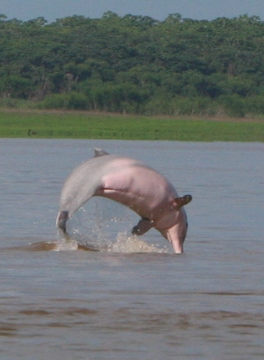

<!DOCTYPE html>
<html lang="pt-br">

<head>
  <meta charset="UTF-8">
  <meta name="author" Isabel Cristina
  <title>
Projeto Vida na Água

</head>

<body>
<header class="header">
<nav class="header__nav">
  <ul>
  <li> <a href="Ecossistemas aquáticos.txt">Inicio</li>
  <li> <a href="Ecossistemas aquáticos.txt">Fauna</li>
  <li> <a href="Ecossistemas aquáticos.txt">Flora</li>
  <li> <a href="Nature.txt">Engajamento</li>
  </ul>
</nav>

 
  <h1>a vida na água : conhecer para preservar</h1>
    <h2>cidadania e conscientização ambiental</h2>

 
</header>
  
<main>
  <section>

<article>
<header>
<h2>Água Doce</h2>
</header>

O mundo já perdeu quase um terço de seus ecossistemas de água doce desde 1970.

A água está no centro das crises climáticas e de biodiversidade.

A proteção da água doce do mundo:- Seus rios, pântanos, aquíferos e ecossistemas, são fatores preponderantes para sobrevivência de todos seres vivos.

   
    <a href="https://www.portalsaofrancisco.com.br/meio-ambiente/ecossistemas-aquaticos" class="btn">Saiba Mais</a>

</article>

<article>
  <header>
  <h2> ecossistemas-aquáticos </h2>
  </header>
  
Apesar de cobrir menos de 1% da superfície da Terra, os ecossistemas de água doce abrigam mais de 10% de todas as espécies conhecidas.
 
  
No entanto, mais de 80% de suas populações de vertebrados foram perdidas devido às ações humanas.

  
Essas perdas são duas vezes maiores do que as perdas sofridas em ecossistemas terrestres, que acabam mesmo assim recebendo mais atenção das ações de conservação.

   
<a href="https://www.esalq.usp.br/banco-de-noticias/conserva%C3%A7%C3%A3o-integrada-pode-ampliar-prote%C3%A7%C3%A3o-de-esp%C3%A9cies-de-%C3%A1gua-doce-em-at%C3%A9-600" class="btn">Saiba Mais</a>
  
  </article>

  <article>
    <header>
    <h2>ecossistemas-aquáticos no Brasil</h2>
    </header>
    
A flora dos ecossistemas aquáticos do Brasil caracterizam-se pelo regime hidrológico dos grandes rios e áreas alagadas e de várzeas.
 
    
O regime hidrométrico tem condições altamente flutuantes produzindo-se pulsos de freqüência e magnitude variadas.
 
    
Estes pulsos apresentam períodos de inundação e seca produzindo grandes alterações na estrutura e funcionamento das comunidades aquáticas.

     
     
     
    <a href="https://ambientes.ambientebrasil.com.br/agua/artigos_agua_doce/a_biota_das_aguas_interiores.html" class="btn">Saiba Mais</a>
        </article>
        
</section> 
</main>

<footer> 

Créditos:

https://es.123rf.com/photo_71574126_la-mejor-manera-de-disfrutar-de-vistas-%C3%BAnicas-y-ver-las-aves-en-sri-lanka-es-visitar-el-bosque.html; 
  www.resumoescolar.com.br/geografia-do-brasil/pantanal-<mato-grossense/
  https://www.pexels.com/pt-br/foto/agua-corrente-rodeada-de-arvores-e-plantas-710906/
  https://faunanews.com.br/wp-content/uploads/2022/01/Fig.-5-Foto-Projeto-Boto.jpg

</footer>
</body>
</html>
